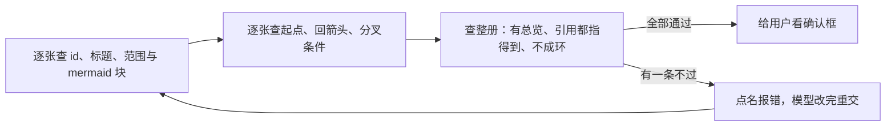

# 校验

从收到提交的图集到给出通过或逐条报错

```mermaid
flowchart LR
  n1["逐张查 id、标题、范围与 mermaid 块"]
  n2["逐张查起点、回箭头、分叉条件"]
  n3["查整册：有总览、引用都指得到、不成环"]
  n4["给用户看确认框"]
  n5["点名报错，模型改完重交"]
  n1 --> n2
  n2 --> n3
  n3 -->|全部通过| n4
  n3 -->|有一条不过| n5
  n5 --> n1
```

## 简报
