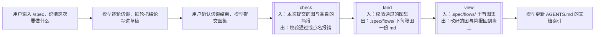

# 一次 spec 访谈

从用户说出这次要做什么，到 .spec/flows/ 里出现新的图集

```mermaid
flowchart LR
  n1["用户输入 /spec，说清这次要做什么"]
  n2["模型逐轮访谈，每轮把结论写进草稿"]
  n3["用户确认访谈结束，模型提交图集"]
  n4[["check<br/>入：本次提交的图与各自的简报<br/>出：校验通过或点名报错"]]
  n5[["land<br/>入：校验通过的图集<br/>出：.spec/flows/ 下每张图一份 md"]]
  n6[["view<br/>入：.spec/flows/ 里有图集<br/>出：改好的图与简报回到盘上"]]
  n7["模型更新 AGENTS.md 的文档索引"]
  n1 --> n2
  n2 --> n3
  n3 --> n4
  n4 --> n5
  n5 --> n6
  n6 --> n7
```

## 简报
