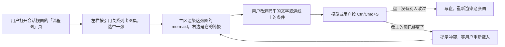

# 看图改图

从打开「流程图」页到把改好的图存回盘上

```mermaid
flowchart LR
  n1["用户打开会话视图的「流程图」页"]
  n2["左栏按引用关系列出图集，选中一张"]
  n3["主区渲染这张图的 mermaid，右边是它的简报"]
  n4["用户改源码里的文字或连线上的条件"]
  n5["模型或用户按 Ctrl/Cmd+S"]
  n6["写盘，重新渲染这张图"]
  n7["提示冲突，等用户重新载入"]
  n1 --> n2
  n2 --> n3
  n3 --> n4
  n4 --> n5
  n5 -->|盘上没有别人改过| n6
  n5 -->|盘上的图已经变了| n7
  n7 --> n3
```

## 简报
